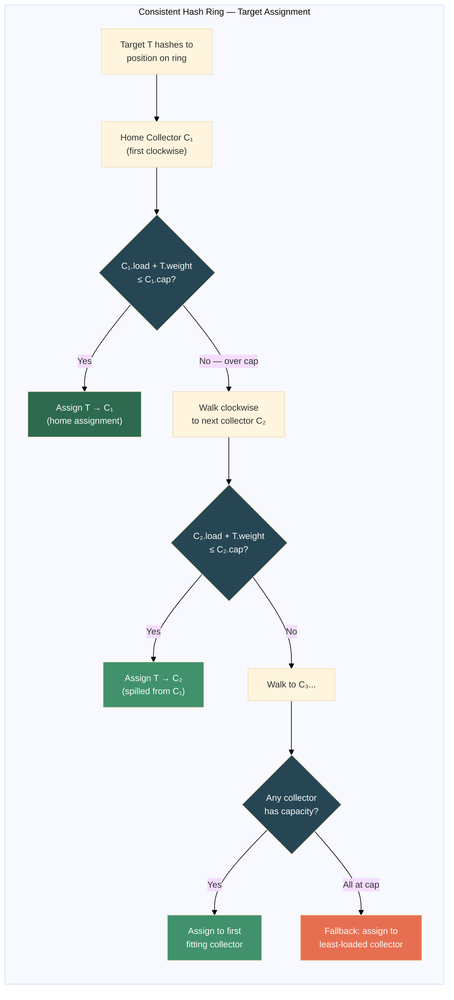
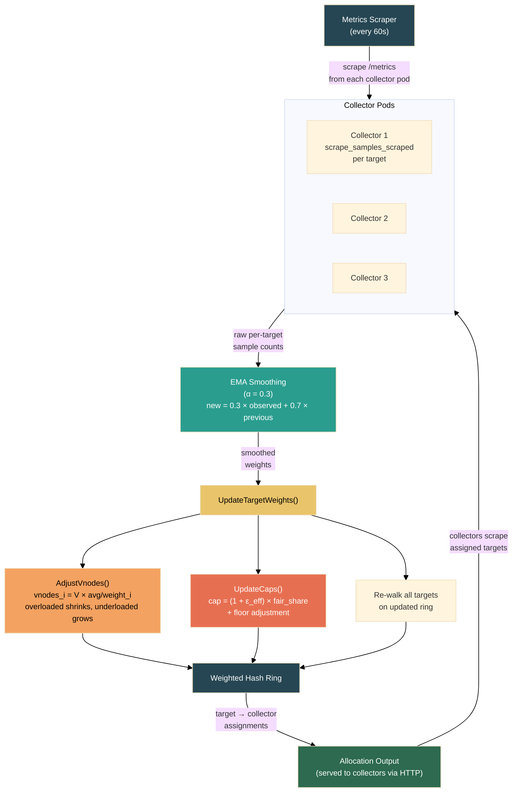

# RFC: Load-Aware Target Allocation Strategy

## Summary

Introduce a new allocation strategy `load-aware-hashing` that distributes scrape targets across collectors using a **weighted consistent hash ring**, where collector capacity is adjusted based on actual scrape load (`scrape_samples_scraped`). Targets are inherently sticky to collectors via the hash ring and only migrate when a collector becomes overloaded — not on every rebalance interval.

## Motivation

All current strategies (`consistent-hashing`, `least-weighted`, `per-node`) treat every target as equal weight. A target returning 5 time series counts the same as one returning 500,000. This causes collector imbalance when target loads are skewed — one collector can be overwhelmed while others are nearly idle, even with an equal number of targets.

## Design

### Feedback Mechanism

The allocator will **scrape each collector's Prometheus `/metrics` endpoint** to read per-target scrape statistics. This is the cleanest approach because:

- The data already exists — every Prometheus receiver exposes `scrape_samples_scraped` per target
- Zero changes required on the collector side
- The allocator already knows collector pod addresses via the collector watcher

The allocator will periodically (every 60s) scrape each collector and parse `scrape_samples_scraped` to build a weight map.

### Weight Metric

`scrape_samples_scraped` (number of time series returned per scrape) is used as the weight. It is a stable, directly proportional proxy for collector resource usage (memory for series, CPU for processing, network for export). Unlike `scrape_duration_seconds`, it is not affected by transient network latency.

### New Strategy: `load-aware-hashing`

A new strategy built on **consistent hashing with bounded loads** (based on [Mirrokni et al., 2018](https://arxiv.org/abs/1608.01350)). Instead of a greedy "pick the lightest collector" approach — which can reshuffle targets on every rebalance tick — this uses a hash ring where targets are inherently sticky to collectors and only migrate when load bounds are violated.

#### How it works

1. **Hash ring with virtual nodes** — Each collector gets `V` virtual nodes on the ring (default: V = 100), hashed using `xxhash.Sum64String()`. Targets are hashed to a position on the ring and assigned to the next collector clockwise, exactly like the existing `consistent-hashing` strategy.

2. **Bounded load cap** — Each collector has a capacity cap (minimum 1.0 to ensure cold-start targets can be assigned):
   ```
   fair_share   = total_weight / num_collectors
   ε_effective  = max(ε_configured, max_target_weight / fair_share − 1)
   cap_i        = (1 + ε_effective) × fair_share
   ```
   where `ε_configured` is the user-set overload tolerance (default: 0.25, meaning 25% above fair share). If the heaviest target exceeds the cap that the configured ε would produce, the **floor adjustment** automatically raises ε so that `cap ≥ max_target_weight`. This guarantees that every target — even the heaviest — can be placed on an empty collector through the normal ring-walk path, rather than falling through to the `leastLoadedCollector` fallback. If a target hashes to a collector that is already at its cap, it "spills" to the next collector on the ring.

   ```mermaid
   %%{init: {'theme': 'base', 'themeVariables': { 'fontSize': '13px', 'background': '#ffffff' }}}%%
   flowchart LR
       subgraph before["Without Floor Adjustment (ε = 0.25)"]
           direction TB
           B1["3 collectors, total weight = 1060\nfair_share = 353\ncap = (1 + 0.25) × 353 = 442"]
           B2["Heavy target (weight 500)\n500 > cap (442) ❌"]
           B3["Walks ALL collectors...\nall caps are 442 — none fit"]
           B4["Falls to leastLoadedCollector\n⚠️ Bounded-load bypassed!"]
           B1 --> B2 --> B3 --> B4
       end

       subgraph after["With Floor Adjustment (ε auto-raised)"]
           direction TB
           A1["3 collectors, total weight = 1060\nfair_share = 353\nmin_ε = 500/353 − 1 = 0.415"]
           A2["effective_ε = max(0.25, 0.415) = 0.415\ncap = (1 + 0.415) × 353 = 500"]
           A3["Heavy target (weight 500)\n500 ≤ cap (500) ✅"]
           A4["Assigned via ring walk\n✅ Bounded-load works!"]
           A1 --> A2 --> A3 --> A4
       end

       style B4 fill:#e76f51,color:#fff
       style A4 fill:#2d6a4f,color:#fff
       style B2 fill:#e9c46a,color:#000
       style A3 fill:#a7c957,color:#000
   ```

3. **Weight-adjusted virtual nodes** — Collector virtual node count is periodically adjusted based on observed load:
   ```
   vnodes_i = V × (avg_collector_weight / collector_i_weight)
   ```
   An overloaded collector gets fewer virtual nodes → it "shrinks" on the ring → some boundary targets naturally fall to the next neighbor. An underloaded collector grows. Crucially, only targets at ring boundaries between collectors are affected — the vast majority stay put.

#### Why this is fundamentally better than greedy rebalancing

| Property | `least-weighted` (greedy + load) | `load-aware-hashing` (this RFC) |
|---|---|---|
| Stickiness | Bolt-on (cooldowns, move budgets) | Structural (hash determines assignment) |
| Target moves on rebalance | Any target can move to any collector | Only boundary targets move to ring neighbor |
| Churn on load fluctuation | Proportional to imbalance magnitude | Proportional to boundary target count (small) |
| Collector scale-up/down | Full reassignment possible | Only ~1/N targets move (consistent hashing property) |
| Ping-pong risk | Requires cooldown to prevent | Hash position is deterministic — no oscillation |
| Scrape gaps | Bounded by move budget per cycle | Bounded by ring boundary math (typically < 5% of targets) |

#### Assignment algorithm

```
for each target:
    pos = xxhash(target_url) on ring
    homeCollector = nil
    walk clockwise from pos:
        for each unique collector encountered:
            if homeCollector is nil:
                homeCollector = collector  // first collector = "home"
            if collector.current_weight + target.weight ≤ collector.cap:
                assign target → collector
                if collector ≠ homeCollector:
                    record in spillMap: target → homeCollector  // track provenance
                break
    // fallback: if all collectors at cap, assign to least-loaded
    //           (ties broken lexicographically by name for determinism)
```

The `GetCollectorForTarget()` method returns `(collectorName, spilledFrom, error)` — the `spilledFrom` value enables tracking which targets were displaced from their home collector.



When the allocator updates virtual node counts based on new weight data, the ring changes minimally — most hash positions still resolve to the same collector.

### Strategy Architecture

The `Collector` struct is **unchanged** — it retains its existing fields (`Name`, `NodeName`, `NumTargets`, `TargetsPerJob`). Weight and vnode tracking are internal to the strategy and hash ring, not exposed on the public struct.

Load-aware behavior is encapsulated in a `loadAwareHashingStrategy` that implements the `Strategy` interface, plus an optional `WeightAwareStrategy` interface for weight updates:

```go
// WeightAwareStrategy is an optional interface that strategies can implement
// to receive target weight updates from the metrics scraper.
type WeightAwareStrategy interface {
    UpdateTargetWeights(weights map[target.ItemHash]float64)
    GetTargetWeight(hash target.ItemHash) float64
}

type loadAwareHashingStrategy struct {
    mu               sync.RWMutex
    ring             *WeightedHashRing
    targetWeights    map[target.ItemHash]float64  // per-target weights (EMA-smoothed)
    spillMap         map[target.ItemHash]string    // tracks spilled targets: hash → home collector
    collectorWeights map[string]float64            // aggregate observed weight per collector
    baseVnodes       int                           // default: 100
    epsilon          float64                       // default: 0.25
}
```

The `allocator` delegates to the strategy via type assertion:

```go
func (a *allocator) UpdateTargetWeights(weights map[target.ItemHash]float64) {
    was, ok := a.strategy.(WeightAwareStrategy)
    if !ok { return }
    was.UpdateTargetWeights(weights)
    a.SetCollectors(a.collectors) // triggers full re-walk of all targets
}
```

### Weighted Hash Ring (`WeightedHashRing`)

The ring tracks per-collector state internally:

```go
type WeightedHashRing struct {
    ring       []virtualNode             // sorted virtual nodes
    collectors map[string]*ringCollector  // per-collector ring state
    baseVnodes int
    epsilon    float64
}

type ringCollector struct {
    name        string
    vnodes      int       // current virtual node count
    currentLoad float64
    cap         float64
    targetCount int
}
```

Vnode counts are clamped to `[1, baseVnodes × 3]` (default: `[1, 300]`) to avoid degenerate cases. The cap floor is `1.0` to ensure cold-start targets (weight 1.0) can always be assigned.

The hash function is `xxhash.Sum64String()` — a fast, non-cryptographic hash providing good distribution.

### Key Methods

- `GetCollectorForTarget(targetKey, targetWeight) → (collectorName, spilledFrom, error)` — the three-value return tracks spill provenance
- `AdjustVnodes(collectorWeights)` — recalculates vnode counts based on observed load
- `UpdateCaps(totalWeight, maxTargetWeight)` — recalculates per-collector capacity caps, applying the floor adjustment when the heaviest target exceeds the cap that the configured ε would produce
- `SetCollectorWeights(weights)` — sets aggregate weights per collector from the scraper
- `GetSpilledTargets()` — returns a map of target hashes to their home collector names

### Periodic Weight Update

The metrics scraper (`internal/collector/metrics/scraper.go`) runs periodically (default: every 60s) and requires real collector pod IPs obtained from the K8s Pod informer via the collector watcher callback:

1. Scrape each collector's `/metrics` endpoint at `http://<podIP>:<metricsPort>/metrics`
2. Parse `scrape_samples_scraped` per target (keyed by `instance` label)
3. Update weights using exponential moving average (EMA, decay factor α = 0.3) to smooth transient spikes
4. Call `allocator.UpdateTargetWeights(smoothedWeights)` which:
   - Updates per-target weights in the strategy
   - Recalculates per-collector aggregate weights, caps, and virtual node counts via `ring.AdjustVnodes()` and `ring.UpdateCaps()`
   - Triggers a full re-walk of all targets via `SetCollectors()` → `handleTargets()`

**Important**: The collector watcher callback provides `podIPs map[string]string` (collector name → `pod.Status.PodIP`) to the scraper. This is essential — the scraper needs real pod IPs, not pod names, to reach collector metrics endpoints.

Note: While the re-walk iterates all targets, most targets don't move. Only targets that now hash to an over-cap collector, or targets that were spilled but whose original collector now has headroom, may migrate.



### Stability Properties (Structural)

Unlike greedy rebalancing which requires bolt-on safeguards, the hash ring provides stability by construction:

1. **Deterministic assignment** — A target always hashes to the same ring position. It only moves if (a) its home collector exceeds the cap, or (b) the collector set changes. No cooldowns needed to prevent ping-pong — the hash is stable.

2. **Bounded movement on ring adjustment** — When virtual node counts change, only targets at the boundaries between collector segments migrate. For a ring with V=100 vnodes per collector and N collectors, a vnode adjustment of ±10% affects roughly ~10% of ring positions, of which only the boundary targets actually move. In practice, this is a small fraction of total targets.

3. **Spill is local** — A target that can't fit on its hashed collector moves to the *next* collector clockwise, not to an arbitrary one. This means series migrate predictably, and the neighbor is deterministic.

4. **EMA smoothing still applies** — Weight updates are EMA-smoothed (α = 0.3), so transient spikes don't cause vnode count oscillation. A bursty target can't flip virtual node counts back and forth because ~70% of the previous weight is retained.

5. **Graceful degradation** — On cold start (no weight data), all collectors have equal vnodes and the strategy behaves identically to plain `consistent-hashing`. Load awareness kicks in incrementally as weight data arrives.

## Edge Cases

| Scenario | Handling |
|---|---|
| **Cold start** (no weight data) | All collectors get equal vnodes (V=100). Strategy behaves identically to plain `consistent-hashing`. New targets get default weight = 1. Load awareness activates incrementally as scrape data arrives. |
| **Collector unreachable** | Retain last known weights and vnode count. The scraper logs the error at V(2) verbosity and retries on the next cycle. No freeze/timeout logic is implemented — stale weights naturally decay via EMA as new data arrives. |
| **Bursty target load** | EMA smoothing (α = 0.3) dampens weight fluctuations. A single burst cannot cause vnode count changes large enough to shift boundary targets. |
| **Target migration scrape gap** | Only boundary targets on the ring can move, and only to the next clockwise neighbor. Affected target count is structurally bounded by ring math (typically <5% per adjustment). |
| **Collector scales to zero** | Consistent hashing property: only that collector's targets redistribute — they spill to the next ring neighbor. All other targets stay put. |
| **Collector scales up** | New collector gets vnodes on the ring. Only ~1/N of existing targets rehash to the new collector (consistent hashing property). |
| **Ping-pong oscillation** | Cannot happen — a target's ring position is deterministic. It sits on collector X unless X is over cap, in which case it spills to X+1. It only returns to X when X has headroom again. No bidirectional bouncing. |
| **All collectors near cap** | The floor adjustment ensures the cap is always ≥ the heaviest target's weight, so a heavy target can always land on at least one empty collector via the ring walk. If workload genuinely exceeds all collector capacity after adjustment, the fallback assigns to the least-loaded collector (ties broken lexicographically by name for multi-replica determinism). Targets are never left unassigned. |
| **Hash collision / hot spot** | With V=100 vnodes per collector, hash distribution is well-balanced. In degenerate cases, a higher V can be configured. |

## Components

| Component | Description | Estimated Lines |
|---|---|---|
| Collector metrics scraper (`internal/collector/metrics/scraper.go`) | Scrape `/metrics` from each collector pod, parse `scrape_samples_scraped`, EMA smoothing | ~200 |
| Weighted hash ring (`internal/allocation/hashring.go`) | `WeightedHashRing` with bounded loads, vnode management, spill logic, fallback | ~250 |
| `load-aware-hashing` strategy (`internal/allocation/load_aware_hashing.go`) | `loadAwareHashingStrategy` + `WeightAwareStrategy` interface, spill tracking | ~200 |
| Collector watcher pod IP plumbing (`internal/collector/collector.go`) | Watch callback provides `podIPs map[string]string` from `pod.Status.PodIP` | ~30 |
| Config plumbing (`internal/config/config.go`) | `LoadAwareHashingConfig` struct, ε / V / interval / port params | ~40 |
| Unit tests | Ring distribution, bounded loads, spill logic, vnode adjustment, EMA, scale-up/down | ~400 |
| E2E test | Verify skewed targets rebalance with minimal churn, measure target movement | ~150 |
| **Total** | | **~1270** |

## Configuration

The strategy is selected via `allocation_strategy: load-aware-hashing` in the TA's config file (`targetallocator.yaml`). Note: `load-aware-hashing` is **not yet added** to the CRD enum (`v1alpha1`/`v1beta1`) — currently it's only configurable via the TA config file directly.

```yaml
# targetallocator.yaml
allocation_strategy: load-aware-hashing

load_aware_hashing:
  weight_update_interval: 60s         # how often to scrape collector weights and adjust ring (default: 60s)
  overload_tolerance: 0.25            # ε — how far above fair share before spilling (default: 0.25)
  virtual_nodes_per_collector: 100    # base vnode count per collector on the hash ring (default: 100)
  weight_smoothing_factor: 0.3        # EMA decay factor, 0 < α ≤ 1 (default: 0.3)
  collector_metrics_port: 8888        # port where collectors expose /metrics (default: 8888)
  gossip:                             # multi-replica gossip sync (see gossip RFC)
    enabled: false                    # default: false (single-replica scraper mode)
```

## Migration

- New strategy name `load-aware-hashing` — fully opt-in, no impact on existing strategies
- Selected via TA config file (`allocation_strategy: load-aware-hashing`). No feature gate is required — the strategy is self-contained and only activates when explicitly selected.
- On cold start (no weight data), behaves identically to plain `consistent-hashing` — same hash ring, equal vnodes, no capacity caps. Load awareness activates incrementally as weight data arrives. This means switching from `consistent-hashing` to `load-aware-hashing` causes **zero target movement** initially.

## Open Questions

1. ~~Should weight smoothing (EMA) be configurable, or use a fixed decay factor?~~ **Resolved:** Configurable via `weight_smoothing_factor` (default: 0.3).
2. ~~Should the rebalance threshold be per-collector or global (max/min ratio)?~~ **Resolved:** Replaced by per-collector bounded load cap with global ε. Each collector's cap is `(1 + ε) × fair_share`, which is both local (per-collector) and globally consistent.
3. ~~Should we support `consistent-hashing` with load awareness (weighted ring), or only extend `least-weighted`?~~ **Resolved:** This RFC now uses weighted consistent hashing as the primary approach. The hash ring provides structural stickiness that greedy rebalancing cannot match.
4. Should we also offer a simpler `least-weighted-load` (greedy) strategy for users who want load-awareness without the complexity of a hash ring? It could be a second strategy in the same feature gate, falling back to the bolt-on stability safeguards (cooldowns, move budgets).
5. Should we expose observability metrics for the ring? Candidates: `target_allocator_ring_adjustments_total`, `target_allocator_targets_spilled`, `target_allocator_collector_load_ratio`. (Not yet implemented.)
6. ~~What is the right default for ε?~~ **Resolved:** 0.25 (25% overload before spilling). When the heaviest target exceeds the cap this would produce, the floor adjustment automatically raises the effective ε so that `cap ≥ max_target_weight`. This means the configured ε is a *minimum* — users don't need to manually tune it for skewed workloads.
7. ~~Should spilled targets be allowed to "return home"?~~ **Resolved:** Yes — spilled targets return home when their original collector has headroom again. The `spillMap` tracks provenance so this is deterministic.
8. Should `load-aware-hashing` be added to the CRD enum (`v1alpha1`/`v1beta1`)? Currently it's only configurable via the TA config file directly.
