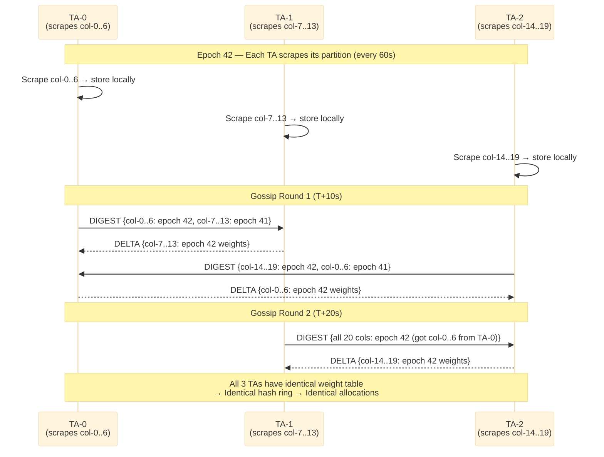
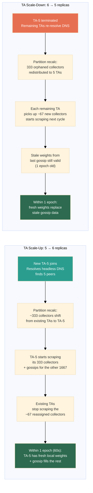

# Sharded Scraping with Gossip Dissemination for Load-Aware TA Scaling

## Problem Statement

The `load-aware-hashing` strategy requires all TA replicas to agree on the **exact same weight map** to produce identical allocations. A single-replica scraper handles this trivially but creates a bottleneck: one TA scrapes every collector's `/metrics` endpoint.

At 2000+ collectors with ~50ms per scrape, a single TA needs **100 seconds** per 60-second cycle — it can never keep up. The TA becomes a CPU/memory hotspot parsing thousands of Prometheus exposition streams while additional replicas sit idle.

## The Algorithm: Dynamo-Style Partitioned Dissemination

This design combines three well-established distributed systems primitives:

### 1. Static Partitioning for Scrape Assignment (inspired by Amazon Dynamo, 2007)

Collectors are partitioned across TA replicas using **simple hash-modulo assignment** — each TA scrapes only the collectors whose `xxhash(collectorName) % len(TAs)` maps to its index. This is intentionally **not** the load-aware weighted hash ring used for target-to-collector allocation. The scrape partition must be:

- **Weight-independent** — computable before any weight data exists (bootstrap / circular dependency avoidance)
- **Deterministic** — every TA computes the same assignment independently with zero communication
- **Stable** — adding/removing a TA only reassigns ~1/N of collectors

The concept of partitioning responsibility via hashing originates from Amazon's Dynamo paper (*"Dynamo: Amazon's Highly Available Key-Value Store"*, DeCandia et al., SOSP 2007). The two partitioning layers in the system are distinct:

| Layer | Algorithm | Weighted? | Purpose |
|---|---|---|---|
| Scrape partitioning (TA → collector) | Simple hash modulo | **No** | Decide which TA scrapes which collector |
| Target allocation (collector → targets) | `load-aware-hashing` with weighted vnodes | **Yes** | Decide which collector monitors which targets |

### 2. Gossip Protocol for State Dissemination (from Epidemic Algorithms, 1987)

Each TA periodically pulls weight data it's missing from a random peer. This is **anti-entropy gossip** — the same protocol used by Cassandra for replica repair, Consul/Serf for cluster membership (SWIM protocol), and Riak for handoff.

The foundational paper is *"Epidemic Algorithms for Replicated Database Maintenance"* (Demers et al., PODC 1987). The key property: with N nodes exchanging state every T seconds, full convergence takes O(log N) rounds — i.e., O(T × log N) seconds regardless of cluster size.

### 3. Last-Writer-Wins Register (CRDT) for Conflict-Free Merge

Each target weight has **exactly one authoritative writer** — the TA replica assigned to scrape the collector that owns that target. This means there are no write conflicts by construction. The weight entry is a **Last-Writer-Wins Register** CRDT (Shapiro et al., *"A Comprehensive Study of Convergent and Commutative Replicated Data Types"*, 2011):

```
LWW-Register {
    Value:     float64    // EMA-smoothed per-target weight (scrape_samples_scraped)
    Timestamp: int64      // epoch when this was scraped
    Writer:    string     // TA pod that wrote it (authoritative owner)
}
```

The key is the **target identity** (job + instance hash), not the collector name. This gives every TA exact per-target weights — the same precision as single-replica mode.

When a TA receives a weight entry from a peer, the merge rule is trivial: **higher timestamp wins**. Since only one TA writes each key (the TA that scrapes the collector hosting that target), there's never a true conflict — the gossip is purely disseminating authoritative values.

## Design

### Architecture Overview

```
                    ┌─────────────────────────────────┐
                    │       Headless Service           │
                    │  ta-standalone-headless          │
                    │  (DNS A records per pod)         │
                    └──────┬──────┬──────┬────────────┘
                           │      │      │
              ┌────────────┘      │      └────────────┐
              ▼                   ▼                    ▼
     ┌─────────────┐     ┌─────────────┐     ┌─────────────┐
     │   TA-0       │     │   TA-1       │     │   TA-2       │
     │              │     │              │     │              │
     │ Assigned:    │     │ Assigned:    │     │ Assigned:    │
     │ col-0..col-6 │     │ col-7..col-13│     │ col-14..col-19│
     │ (7 of 20)    │     │ (7 of 20)    │     │ (6 of 20)    │
     │              │     │              │     │              │
     │ Scrapes only │     │ Scrapes only │     │ Scrapes only │
     │ its assigned │     │ its assigned │     │ its assigned │
     │ collectors   │     │ collectors   │     │ collectors   │
     │              │     │              │     │              │
     │ Weight table:│     │ Weight table:│     │ Weight table:│
     │ ALL 20 cols  │     │ ALL 20 cols  │     │ ALL 20 cols  │
     │ (7 local +   │     │ (7 local +   │     │ (6 local +   │
     │  13 gossiped)│     │  13 gossiped)│     │  14 gossiped)│
     └──────┬───────┘     └──────┬───────┘     └──────┬───────┘
            │                    │                    │
            │◄──── gossip pull ──┤◄──── gossip pull ──┤
            │     (every 10s,    │     (random peer)  │
            │      random peer)  │                    │
            ├──── gossip pull ──►│                    │
            │                    ├──── gossip pull ──►│
            │                    │                    │
     ┌──────┴────────────────────┴────────────────────┴──────┐
     │              All 3 TAs converge to                     │
     │         the SAME weight table for ALL 20 collectors    │
     │              → same hash ring → same allocation        │
     └───────────────────────────────────────────────────────┘
```

### Step-by-Step Flow

#### 1. Peer Discovery

Each TA discovers peers via the **headless Service** DNS:

```
ta-standalone-headless.namespace.svc.cluster.local
→ A records: [10.0.0.1, 10.0.0.2, 10.0.0.3]
```

The TA filters out its own IP and maintains a peer list. DNS is re-resolved every gossip interval (10s) to detect new/removed replicas.

#### 2. Scrape Partition Assignment

Given the set of TA pod IPs (sorted) and collector names, each TA determines which collectors it's responsible for:

```go
func AssignedCollectors(localIndex, totalReplicas int, collectors []string) []string {
    var mine []string
    for _, col := range collectors {
        // Hash collector name, modulo number of TAs
        owner := xxhash.Sum64String(col) % uint64(totalReplicas)
        if int(owner) == localIndex {
            mine = append(mine, col)
        }
    }
    return mine
}
```

Peer discovery provides `TotalReplicas()` and `LocalIndex()` (the index of the local pod IP in the sorted list of all TA pod IPs). This avoids needing pod names — partition assignment uses IP-sorted indices.

With 2000 collectors and 5 TAs, each TA scrapes ~400 collectors. When a TA is added (scale-up from 5→6), ~333 collectors shift to the new TA — the rest stay assigned to their current scraper.

**Why not consistent hashing for partition assignment?** Simple modulo is sufficient here because:
- The keyspace is small (collector names, not millions of keys)
- Reassignment on scale happens rarely and the cost is just "scrape a few different collectors next cycle"
- No data migration needed — it's ephemeral weight data

#### 3. Local Scrape Cycle

Every 60 seconds, each TA scrapes **only its assigned collectors**:

```
Epoch 42 (T=0:00 to T=1:00):

TA-0: scrapes col-0, col-3, col-6, col-9, ...  (400 collectors)
TA-1: scrapes col-1, col-4, col-7, col-10, ... (400 collectors)
TA-2: scrapes col-2, col-5, col-8, col-11, ... (400 collectors)
...
```

Each scrape produces per-target weight observations by parsing `scrape_samples_scraped` labels:

```go
type WeightEntry struct {
    TargetKey  string  `json:"target"`    // target identity (hash of job + instance)
    Weight     float64 `json:"weight"`    // EMA-smoothed scrape_samples_scraped
    Epoch      int64   `json:"epoch"`     // Unix time / 60
    Writer     string  `json:"writer"`    // TA pod name (scraper of the hosting collector)
}
```

After scraping, the TA writes entries to its **local weight table** — a `map[string]WeightEntry` keyed by target identity. A single collector hosting 10 targets produces 10 weight entries with exact per-target sample counts.

#### 4. Gossip Exchange

Every 10 seconds, each TA runs one gossip round:

```
1. Pick random peer from known TA list
2. Send DIGEST to peer:
   {
     "epoch": 42,
     "entries": {
       "col-0": {epoch: 42, writer: "ta-0"},   // metadata only, no weight value
       "col-1": {epoch: 41, writer: "ta-1"},   // stale — I have last epoch's data
       "col-3": {epoch: 42, writer: "ta-0"},
       ...
     }
   }
3. Peer compares digest against its own table:
   - For each key where peer has a NEWER epoch → include in response
   - For each key where peer has an OLDER epoch → request from sender
4. Exchange missing/stale entries
```

This is **pull-based anti-entropy** — each round, a TA synchronizes with one random peer. The protocol has three message types:

| Message | Content | Direction |
|---------|---------|-----------|
| `DIGEST` | `{collector → (epoch, writer)}` for all known collectors | Initiator → Peer |
| `DELTA` | Full weight entries that the requester is missing or stale | Peer → Initiator |
| `DELTA_REQUEST` | List of collectors where peer is stale (optional; optimizes bidirectional sync) | Peer → Initiator |

#### 5. Convergence and Allocation



After gossip converges (all TAs have the same weight table), each TA independently:

1. Feeds the weight table into `UpdateTargetWeights()`
2. Rebuilds the weighted hash ring
3. Produces identical allocations (because weights are byte-identical)

**Convergence time**: With N TAs and 10s gossip interval, full dissemination takes `O(log₂(N) × 10s)`:

| TA replicas | Gossip rounds to converge | Wall-clock time |
|-------------|--------------------------|-----------------|
| 3 | 2 | ~20s |
| 5 | 3 | ~30s |
| 10 | 4 | ~40s |
| 20 | 5 | ~50s |

This fits well within the 60-second scrape epoch.

### Merge Rule: Why Determinism is Guaranteed

The critical insight: **each target weight key has exactly one authoritative writer** — the TA assigned to scrape the collector that currently hosts that target. This makes the merge rule trivial and conflict-free:

```go
func mergeEntry(local, remote WeightEntry) WeightEntry {
    if remote.Epoch > local.Epoch {
        return remote  // newer epoch always wins
    }
    if remote.Epoch == local.Epoch && remote.Writer > local.Writer {
        return remote  // tie-break by writer name (deterministic)
    }
    return local
}
```

Since `Writer` is deterministic (the TA scraping the hosting collector) and `Epoch` advances monotonically, all TAs that receive the same set of gossip messages converge to the **exact same weight table** — regardless of message ordering.

This is a **Last-Writer-Wins Register CRDT** with the additional guarantee that there's only one writer per key, so the "conflict resolution" path (same epoch, different writer) never triggers in normal operation — it's a safety net for partition reassignment during TA scale events.

**Note on target migration:** When the allocator moves a target from collector A to collector B, the authoritative writer for that target's weight changes from the TA scraping A to the TA scraping B. The next scrape cycle produces a new entry with a higher epoch, which naturally supersedes the old one via the LWW merge rule.

### Handling Edge Cases



#### TA Scale-Up (5 → 6 replicas)

1. New TA-5 joins, resolves headless DNS, discovers peers
2. TA-5 computes its partition: ~333 collectors shift from existing TAs
3. TA-5 starts scraping its assigned collectors
4. TA-5 gossips with peers to get weights for non-assigned collectors
5. Existing TAs notice (via DNS re-resolve) that their partition shrank — they stop scraping the ~67 collectors that moved to TA-5
6. **Transition period** (~1 epoch): old weights for reassigned collectors still valid (same EMA, just stale by one epoch). TA-5's first scrape produces fresh weights that propagate via gossip.

#### TA Scale-Down (6 → 5 replicas)

1. TA-5 is terminated
2. Remaining TAs re-resolve DNS, recalculate partitions
3. ~333 collectors that were on TA-5 are now assigned to remaining TAs
4. Those TAs start scraping them immediately
5. **Transition period**: collectors previously owned by TA-5 have last-epoch weights from gossip. Still valid for allocation — just one epoch stale.

#### Collector Joins/Leaves

When a new collector appears (via K8s Pod informer), all TAs see it simultaneously. The partition assignment is recalculated, and the assigned TA starts scraping it in the next cycle. Weight = 0 (default) until first scrape.

#### Network Partition

If TA-0 is partitioned from TA-1 and TA-2:
- TA-0 has authoritative weights for its ~400 collectors but stale values for the other ~1600
- TA-1 and TA-2 have fresh values for their combined ~1200 but stale for TA-0's ~400
- Allocations **may diverge** during the partition — collectors talking to TA-0 get different assignments than those talking to TA-1
- On heal, the next gossip round (10s) re-converges all TAs

This is **eventually consistent** — the same model as the existing `consistent-hashing` strategy during K8s informer sync delays.

### Comparison at Scale

| Metric | Single-Replica Scraper | Sharded Scraping + Gossip |
|--------|------------------------|--------------------------|
| **Scrapes per TA (2000 collectors, 5 TAs)** | 2000 (single TA) / 0 (others) | **400 each** |
| **Total scrapes per cycle** | 2000 | 2000 |
| **Per-TA CPU/memory** | Extreme (scraper TA) / idle (others) | **Even across all TAs** |
| **Single point of failure** | Yes (scraper TA) | **No** |
| **Deterministic convergence** | Yes (instant, local) | Yes (within O(log N × 10s) gossip) |
| **K8s API write load** | None | **None** |
| **Network overhead** | None | ~N gossip pulls per 10s interval |
| **Failure mode** | Scraper TA dies → no weight updates | TA dies → remaining TAs absorb partition |
| **Max collectors (per TA)** | ~1000 (60s budget) | **Unlimited (scales linearly with replicas)** |
| **Code complexity** | ~200 LOC (scraper only) | **~800 LOC** |
| **New dependencies** | None | Headless Service, gossip HTTP endpoints |

### Implementation Components

| Component | Estimated LOC | Description |
|-----------|--------------|-------------|
| Peer discovery (`/internal/gossip/discovery.go`) | ~100 | Headless DNS resolution, peer list management |
| Partition assignment (`/internal/gossip/partition.go`) | ~60 | Hash-based collector-to-TA mapping |
| Weight table (`/internal/gossip/weights.go`) | ~120 | Thread-safe `map[string]WeightEntry` keyed by target identity, with LWW merge |
| Gossip protocol (`/internal/gossip/gossip.go`) | ~200 | Digest/delta exchange over HTTP, 10s tick loop |
| HTTP endpoints (`/internal/gossip/handler.go`) | ~100 | `POST /internal/gossip/digest`, `POST /internal/gossip/delta` |
| Integration (`/internal/gossip/manager.go`) | ~150 | Wires peer discovery + partition + scraper + gossip + allocator |
| Headless Service manifest | ~15 | Additional Service with `clusterIP: None` |
| **Total** | **~800** | |

### Gossip Manager: Integration Details

The gossip `Manager` is the central orchestrator in multi-replica mode. It replaces the standalone `Scraper` and combines scraping, gossip, and weight delivery:

```go
type Manager struct {
    allocator        allocation.Allocator
    discovery        *PeerDiscovery
    weights          *WeightTable
    protocol         *Protocol
    localName        string               // from HOSTNAME or POD_NAME env
    localIP          string               // from POD_IP env
    collectorPodIPs  map[string]string     // collector name → pod IP
    smoothedWeights  map[target.ItemHash]float64  // EMA-smoothed per-target weights
    client           *http.Client
}
```

**Environment variables required for Manager bootstrap:**

| Variable | Purpose | Fallback |
|----------|---------|----------|
| `HOSTNAME` or `POD_NAME` | Local pod identity for gossip messages | Required |
| `POD_IP` | Local IP to filter self from peer list | Required |
| `POD_NAMESPACE` or `OTELCOL_NAMESPACE` | Namespace for headless DNS construction | Required |

**Manager runs two concurrent loops:**

1. **Scrape loop** (every `weight_update_interval`, default 60s): Scrapes only the locally-assigned partition of collectors, stores results in the weight table with `SetLocal()`, then pushes weights to the allocator
2. **Gossip loop** (every `gossip.interval`, default 10s): Resolves peers via DNS, runs `protocol.RunRound()` to exchange weight data with random peers

**Per-target weight precision:**

The gossip weight table stores **per-target** weights (individual `scrape_samples_scraped` values parsed from each collector's `/metrics` endpoint). Each target is keyed by its identity (job + instance hash), giving every TA the same exact per-target weights that a single-replica scraper would have — no approximation needed.

The Manager applies EMA smoothing (same α as the single-replica scraper) before calling `allocator.UpdateTargetWeights()`.

Note: When `UpdateTargetWeights()` recalculates caps, it applies a **floor adjustment** — if the heaviest target exceeds the cap that the configured ε would produce, the effective ε is raised so that `cap ≥ max_target_weight`. See the [load-aware-allocation RFC](load-aware-allocation.md) for details.

**`onConverge` callback:** After each successful gossip round, the Protocol calls an `onConverge` callback. The Manager uses this to immediately push updated weights to the allocator, ensuring weight data propagated via gossip is applied without waiting for the next scrape cycle.

**HTTP endpoint registration:** The gossip endpoints are registered on the TA's existing HTTP server (gin router) via `server.WithRouteRegistrar()` in `main.go`:

```go
gossip.RegisterHandlers(router, log, gossipManager.WeightTable(), gossipManager.LocalName())
// Creates: POST /internal/gossip/digest
//          POST /internal/gossip/delta
```

### Gossip Configuration

Configuration is nested inside `load_aware_hashing` in the TA config file:

```yaml
load_aware_hashing:
  gossip:
    enabled: true                                              # default: false
    headless_service_dns: "ta-headless.ns.svc.cluster.local"   # or constructed from headless_service_name + namespace
    headless_service_name: "ta-headless"                       # short name, combined with POD_NAMESPACE
    interval: 10s                                              # gossip pull interval (default: 10s)
    fan_out: 1                                                 # random peers per round (default: 1)
    gossip_port: 0                                             # default: 0 (uses TA's own listen port)
```

Note: `gossip_port: 0` means "use the TA's main HTTP listen port" — gossip endpoints are served on the same server as the allocation API.

### When to Use Which Approach

| Scenario | Recommended Approach |
|----------|---------------------|
| Single replica, any collector count | **Single-replica scraper** (`gossip.enabled: false`) — simplest, no coordination |
| 2+ replicas, < 500 collectors | **Single-replica scraper** — one TA handles the scrape load fine |
| 2+ replicas, 500–2000 collectors | **Sharded Scraping + Gossip** (`gossip.enabled: true`) — distributes scrape load |
| 2000+ collectors, any replica count | **Sharded Scraping + Gossip** — scales linearly with replicas |
| Maximum availability (no SPOF) | **Sharded Scraping + Gossip** — fully leaderless |

### Phased Rollout

| Phase | Approach | Status |
|-------|----------|--------|
| Phase 1 | Single-replica embedded scraper (`gossip.enabled: false`) | **Implemented** |
| Phase 2 | ~~Leader + ConfigMap~~ | **Skipped** — went directly to gossip |
| Phase 3 | Sharded Scraping + Gossip (`gossip.enabled: true`) | **Implemented** |

The two modes are toggled via `load_aware_hashing.gossip.enabled` in the TA config:
- `false` (default): Single-replica mode — the metrics scraper runs locally and scrapes all collectors
- `true`: Multi-replica mode — gossip-based sharded scraping with LWW-Register weight sync

## Memory Footprint Analysis

### Per-target weight entry in memory

```go
type WeightEntry struct {
    TargetKey  string   // ~40 bytes avg (hash of job + instance)
    Weight     float64  // 8 bytes
    Epoch      int64    // 8 bytes
    Writer     string   // ~20 bytes avg ("ta-standalone-0")
}
// Go struct overhead: ~16 bytes (header + padding)
// Go map entry overhead: ~80 bytes (hash bucket, key pointer, value pointer)
// Total per entry: ~172 bytes
```

### Weight table size by target count

With an average of 10 targets per collector:

| Collectors | Targets | Weight table size | % of typical TA memory (80–150 MB) |
|------------|---------|------------------|-------------------------------------|
| 100 | 1,000 | 172 KB | 0.1–0.2% |
| 500 | 5,000 | 860 KB | 0.6–1.1% |
| 2,000 | 20,000 | 3.4 MB | 2.3–4.3% |
| 10,000 | 100,000 | 17.2 MB | 11–22% |

### Full memory breakdown at 2000 collectors (20K targets)

| Component | Memory | New for load-aware? |
|---|---|---|
| Collector objects (Pod informer cache) | 400 KB | No |
| Target items (10 targets/collector avg, 20K total) | 1.6 MB | No |
| Hash ring (150 vnodes/collector) | 960 KB | No |
| Scrape config cache | ~200 KB | No |
| **Weight table (20K targets)** | **3.4 MB** | **Yes** |
| **Gossip peer state (5 TAs × digest)** | **~20 KB** | **Yes** |
| **Total** | **~6.6 MB** | |

The weight table adds **3.4 MB** at 20K targets — ~10x more than per-collector gossip would use, but still under 5% of typical TA process memory. The tradeoff is worth it: every TA gets exact per-target weights, eliminating the lossy approximation that per-collector gossip required.

At extreme scale (100K+ targets), the weight table becomes significant (~17 MB). For these cases, consider increasing TA memory limits or using delta-compressed gossip (only transmit changed entries).

Memory is manageable for this design at typical scale. The constraint at scale is **scrape CPU time** (parsing Prometheus exposition responses), which is exactly what sharding solves.

### Gossip Convergence Analysis

Anti-entropy gossip converges when every replica has received every other replica's weight data. With random peer selection (pull from 1 random peer per round), convergence follows the **coupon collector problem**: each round a replica learns about one new peer's data, and it takes approximately $N \cdot \ln(N)$ rounds on average for all $N$ replicas to have the complete picture.

However, in practice the bound is tighter because:
1. Each digest exchange can transfer **multiple** peers' data (a replica forwards everything it knows, not just its own weights)
2. This gives exponential information spread — closer to $\lceil \log_2(N) \rceil$ rounds for full convergence (epidemic dissemination)

#### Convergence times by TA count

Assuming gossip interval = 10s, fan-out = 1 (pull from 1 random peer per round):

| TA replicas | Rounds to converge (log₂N) | Wall-clock time | Fits in 60s epoch? |
|---|---|---|---|
| 2 | 1 | 10s | Yes |
| 3 | 2 | 20s | Yes |
| 5 | 3 | 30s | Yes |
| 10 | 4 | 40s | Yes |
| 20 | 5–7 | 50–70s | Borderline |
| 50 | 6–8 | 60–80s | No |

**Problem**: At 20+ TAs, convergence may exceed the 60s default epoch boundary. If weights haven't fully propagated before the next epoch's allocation computation, some replicas will compute the hash ring with stale/incomplete weights, leading to temporary allocation disagreements.

#### Mitigations for large TA deployments

1. **Faster gossip interval** (3–5s instead of 10s): Reduces wall-clock convergence proportionally. At 3s interval, 20 TAs converge in 15–21s.

2. **Higher fan-out** (pull from 2–3 peers per round): Each round acquires more information. Fan-out = 2 roughly halves the number of rounds needed.

3. **Longer epochs** (120s instead of 60s): Gives more time for convergence before the next rebalance. Tradeoff: slower reaction to load changes.

4. **Push+Pull hybrid**: When a TA finishes scraping, it immediately pushes its digest to 2 random peers (push phase). The regular pull interval then fills gaps. This front-loads dissemination right when new data is produced.

#### Recommended gossip parameters by scale

| TA replicas | Gossip interval | Fan-out | Epoch | Expected convergence |
|---|---|---|---|---|
| 1–3 | 10s | 1 | 60s | < 20s |
| 3–10 | 10s | 1 | 60s | < 40s |
| 10–20 | 5s | 2 | 90s | < 25s |
| 20–50 | 3s | 2 | 120s | < 24s |

These are configurable via the TA config file (`load_aware_hashing.gossip.*`), with sensible defaults for the common case (3–5 TAs).

### Network Load Analysis

#### Digest message structure

Each gossip exchange starts with a **digest** — a compact summary of what the sender knows:

```
Digest = []DigestEntry{
    {TargetKey string, Epoch int64, Writer string}
}
```

Per entry: ~40 bytes (target key) + 8 bytes (epoch) + ~20 bytes (writer) + ~10 bytes (JSON framing) = **~78 bytes/entry**.

For 2000 collectors with 10 targets each (20K targets): `20,000 × 78 = ~1.56 MB` per digest.

#### Delta response

After comparing digests, the responder sends only **missing or newer entries** (full `WeightEntry` with the `float64` weight value). In steady state after initial convergence, deltas are small — only entries updated since the last exchange, typically the sender's own partition (~targets on scraped collectors).

For 2000 collectors with 5 TAs, each TA scrapes ~400 collectors × ~10 targets = ~4000 targets. A delta after one epoch contains ~4000 entries × 86 bytes = **~344 KB**.

#### Gossip bandwidth by scale

Per gossip round, each TA initiates `fan-out` pull requests. Each pull = 1 digest sent + 1 delta received. Targets = collectors × 10 (average).

| TA replicas | Collectors | Targets | Fan-out | Digest size | Steady-state delta | Traffic/TA/round | Traffic/TA/min (10s interval) |
|---|---|---|---|---|---|---|---|
| 3 | 500 | 5K | 1 | 390 KB | 143 KB | 533 KB | 3.2 MB |
| 5 | 2,000 | 20K | 1 | 1.56 MB | 344 KB | 1.9 MB | 11.4 MB |
| 10 | 5,000 | 50K | 1 | 3.9 MB | 430 KB | 4.3 MB | 25.8 MB |
| 20 | 10,000 | 100K | 2 | 7.8 MB | 430 KB | 16.5 MB | 99 MB |

**Note:** At large scale (10K+ collectors), digest sizes become the dominant cost. This can be mitigated by:
- **Digest compression**: gzip reduces digest size by ~60–70% (repetitive structure)
- **Bloom filter digests**: instead of full key listing, send a Bloom filter of `(targetKey, epoch)` pairs — reduces digest to ~2 bits/entry
- **Incremental digests**: only include entries that changed since the last exchange with that peer

#### Comparison with single-replica scraper

| Aspect | Single-replica scraper | Gossip |
|---|---|---|
| Write path | Single TA scrapes all collectors locally | Each TA scrapes only its partition, gossips the rest |
| Bottleneck | Single TA CPU/memory for all scrapes | Distributed — each TA scrapes ~1/N |
| Data transferred | None (all local) | Incremental deltas only (peer-to-peer) |
| API server load | Zero | Zero |
| Network per TA/min | Zero | ~11 MB (digests + deltas, 6×/min at 2000 collectors / 20K targets) |
| Failure domain | Scraper TA dies → stale weights | Peer down → skip, converge next round |

At moderate scale (5 TAs, 2000 collectors, 20K targets), gossip adds ~11 MB/min network overhead per TA but:
- **Distributed scraping** — each TA handles only ~400 collectors instead of 2000
- **Zero API server load** — critical in large clusters where etcd is the bottleneck
- **Incremental** — only deltas flow after initial sync, so actual bytes are smaller in practice
- **Resilient** — no single point of failure; partition-tolerant by design

### Single-replica behavior

With 1 TA replica, the gossip layer is a no-op:

- Partition assignment: 100% of collectors assigned to the single TA
- Gossip: headless DNS resolves no peers → gossip tick returns immediately
- Weight table: populated entirely from local scrapes, no merge needed
- Overhead: zero — degrades gracefully to the current Phase 1 implementation

| Scale | Replicas | Gossip active? | Load-aware benefit |
|---|---|---|---|
| 1–100 collectors | 1 | No | Full — rebalances hot/cold collectors |
| 100–500 collectors | 1–2 | Minimal (1 peer) | Full — single TA handles scrape load fine |
| 500–2000 collectors | 3–5 | Yes | Full — scrape load distributed ~400/TA |
| 2000+ collectors | 5+ | Yes | Full — scales linearly with replicas |
